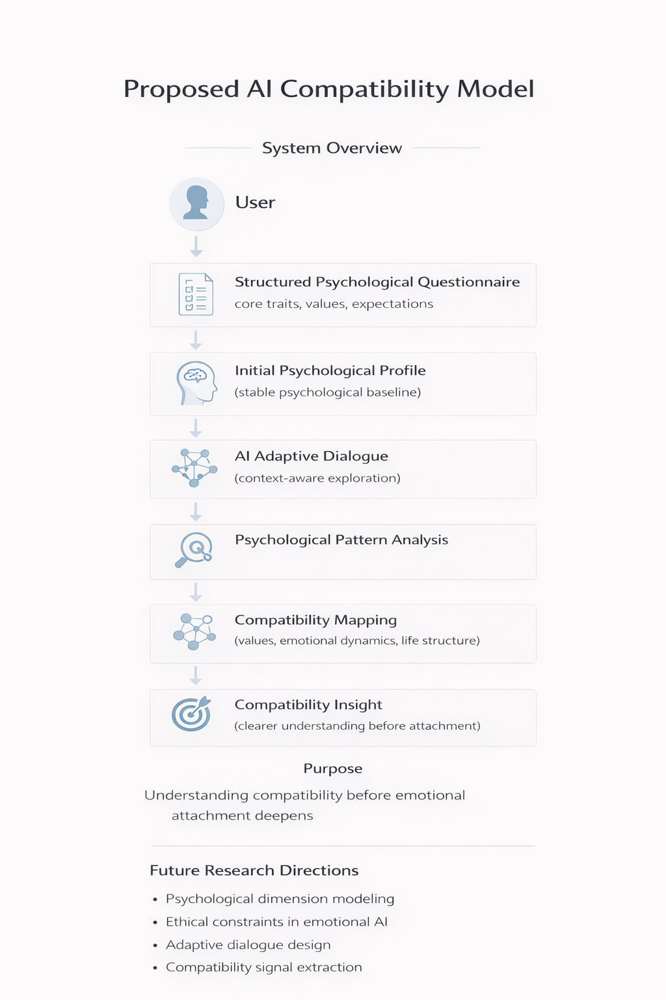

# Religna

AI for long-term relationship compatibility

Know before you attach.

Author: Maksim Nagaev

Religna is a conceptual AI system designed to help people understand long-term psychological compatibility before emotional attachment forms.

Instead of optimizing attraction or engagement, the system focuses on deeper alignment — including values, emotional patterns, attachment tendencies, and long-term lifestyle structure.

The goal is not to decide for users, but to reveal hidden compatibility dynamics, potential tensions, and long-term risks.

**The system supports awareness — not decision-making.**
---

## Core Idea

Most modern relationship technologies optimize for engagement, not compatibility.

This project explores a different approach:

Using AI to identify deep psychological alignment, reveal hidden incompatibilities, and support better relationship decisions before emotional attachment forms.

The system does not decide — it helps users understand.

---

## System Overview

The proposed system combines structured psychological assessment with adaptive AI interaction:

1. **User Input**
   - Public profile (visible to others)
   - Private psychological questionnaire (hidden)

2. **Psychological Profiling**
   Initial baseline based on values, emotional patterns, expectations, and lifestyle

3. **Adaptive AI Dialogue**
   Dynamic interaction designed to:
   - uncover inconsistencies
   - surface implicit beliefs
   - explore emotional reactions

4. **Psychological Pattern Analysis**
   Identification of stable behavioral and relational patterns

5. **Compatibility Mapping**
   Comparison of two profiles across multiple dimensions:
   - alignment zones
   - tension zones
   - risk zones

---

## System Flow

User Input → Psychological Profiling → Adaptive Dialogue → Refined Profile → Compatibility Mapping

---

## Key Differentiators

- Focus on long-term compatibility, not attraction
- Adaptive dialogue instead of static questionnaires
- Detection of inconsistencies and hidden patterns
- Multidimensional psychological modeling
- No gamification, no engagement optimization

---

## Why This Matters

Most relationship platforms are designed to maximize attention and interaction.

This creates a fundamental misalignment:
they optimize for engagement, not long-term relational stability.

This project explores whether AI can instead be used to support clarity, compatibility, and healthier relationship decisions.

---

## Compatibility Model Diagram

Conceptual architecture illustrating how structured assessment and adaptive dialogue support compatibility insight.

---

## Key Principles

- AI should support human autonomy, not replace it
- Compatibility is multidimensional and dynamic
- Long-term stability matters more than short-term engagement
- Technology should clarify decisions, not manipulate emotions

---

## Status

Early-stage conceptual framework.

No product or implementation currently exists.

---

## Concept Paper

Full conceptual framework:

Notion:  
https://button-alyssum-638.notion.site/Ethical-AI-for-Long-Term-Partner-Compatibility-31745b82b9708019988ecb95b538ed3d?pvs=143

---

## Related Writing

Medium articles:

- Ethical AI for Long-Term Partner Compatibility  
- Dating Apps Use AI — But Still Fail at Matching People  

---

## Author

Maksim Nagaev

LinkedIn:  
https://www.linkedin.com/in/maksim-nagaev-9a03013a8/

Medium:  
https://medium.com/@EthicalAIforLongTermPartnerCom/dating-apps-use-ai-but-still-fail-at-matching-people-a32868fd7e35

---

Open to discussion and collaboration.
